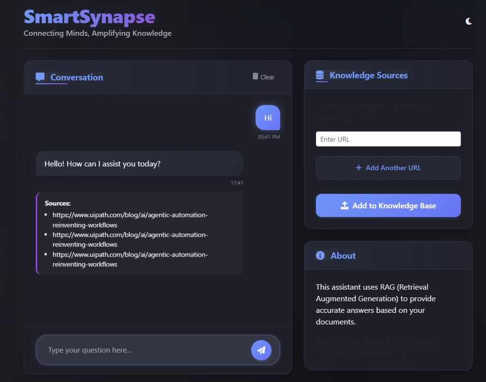
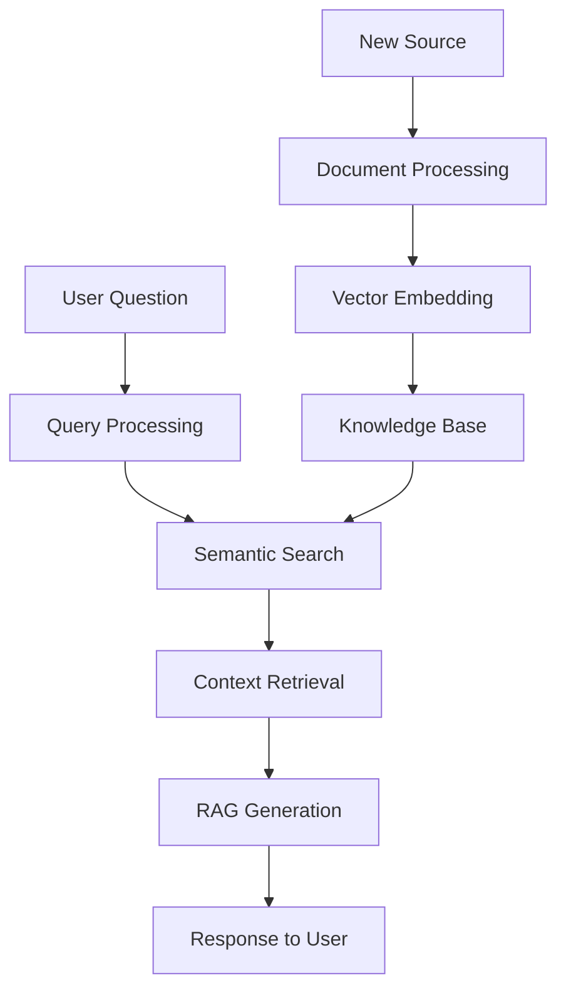
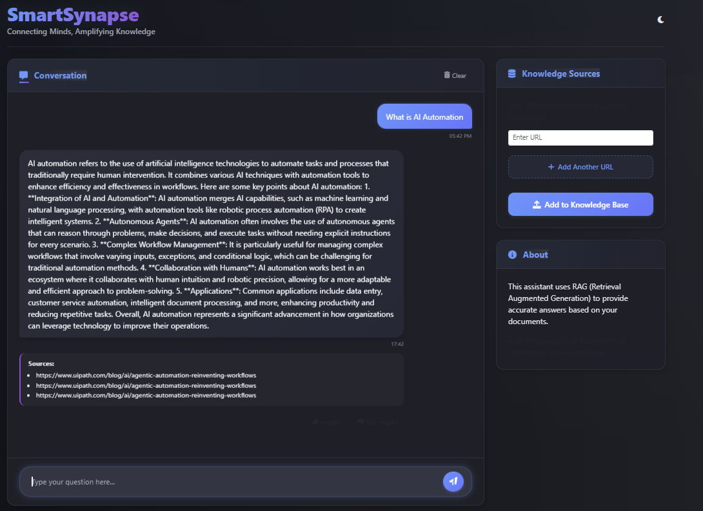
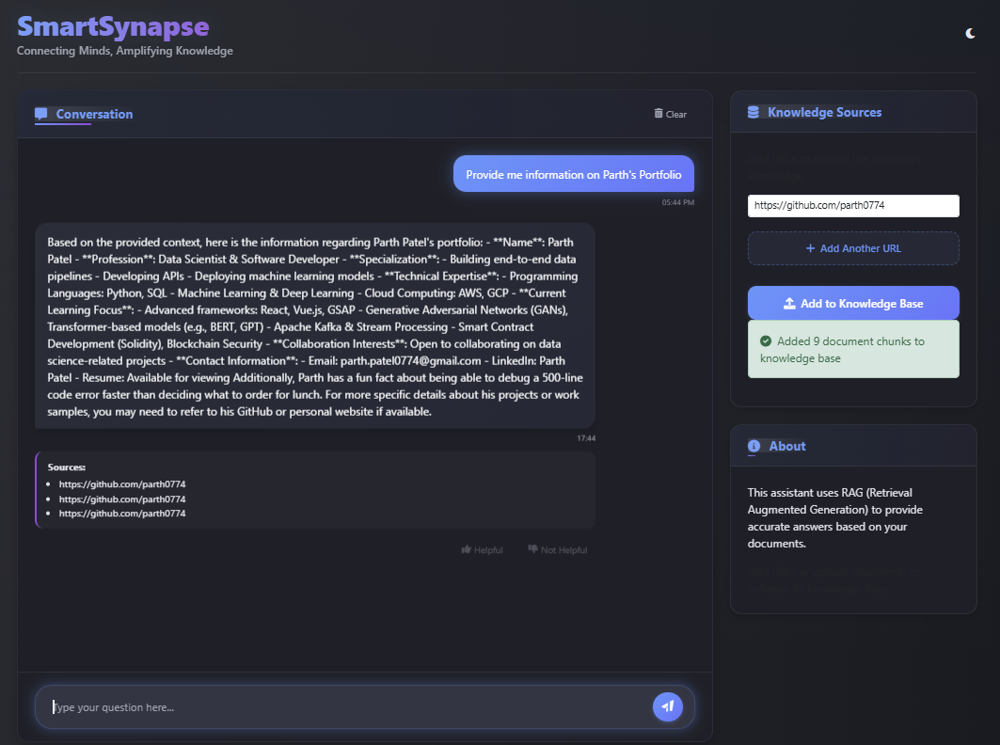

# 🧠 SmartSynapse RAG Chatbot 🤖

<div align="center">



[](LICENSE)
[](https://www.python.org/downloads/)
[](https://langchain.com)
[](https://openai.com)

<p align="center">
  <a href="#-overview">Overview</a> •
  <a href="#-key-features">Features</a> •
  <a href="#-how-it-works">How It Works</a> •
  <a href="#-usage">Usage</a> •
  <a href="#-installation">Installation</a> •
  <a href="#-tech-stack">Tech Stack</a>
</p>

</div>

## 🌟 Overview

SmartSynapse is an intelligent conversational AI system that leverages **Retrieval-Augmented Generation (RAG)** to provide accurate, context-aware responses based on a dynamic knowledge base. This cutting-edge chatbot not only answers questions but also learns from new sources you provide!

> 💡 **SmartSynapse combines the intelligence of large language models with the precision of information retrieval systems.**

## ✨ Key Features

- 🗣️ **Natural Conversational Interface** - Fluid dialogue with context memory
- 🔄 **Dynamic Knowledge Base** - Add custom sources on-the-fly
- 📚 **Source Attribution** - See exactly where information comes from
- 🔍 **Semantic Search** - Finds relevant context even with different wording
- 🧩 **Smart Document Processing** - Handles web content through chunking
- 🔗 **Web Integration** - Add knowledge from any accessible URL
- 🔒 **Privacy Focused** - Your conversations stay private
- 🚀 **Optimized Performance** - Fast responses with accuracy

## 🛠️ How It Works

<div align="center">



</div>

📥 **Initialize Knowledge** - System starts with default information sources  
🔢 **Vector Embedding** - Converts text chunks into numerical representations  
❓ **Process Queries** - Understands natural language questions  
🔍 **Find Relevant Context** - Retrieves the most similar information  
🧠 **Generate Answers** - Combines retrieved context with AI generation  
📝 **Track Sources** - Maintains references to original information  

## 📱 Usage

### ✅ General Queries
Ask anything and get answers from the default knowledge base:
<div align="center">
  
</div>

### 📚 Expanding Knowledge Base
Add GitHub repositories, articles, or any web URL to enhance what your bot knows:
<div align="center">
  
</div>

### 🔍 Custom Knowledge Queries
Ask questions about your newly added sources:
<div align="center">
  
</div>

## 📦 Installation

```bash
# Clone the repository
git clone https://github.com/parth0774/SmartSynapse-Rag-Chatbot.git

# Create virtual environment
python -m venv venv

# Activate virtual environment
venv\Scripts\activate

# Install dependencies
pip install -r requirements.txt

# Set up environment variables (create .env file)
echo "OPENAI_API_KEY=your_openai_api_key" > .env
echo "USER_AGENT= add_user_agent" >> .env

# Run the application
python app.py
```

## 🔧 Configuration
Create a `.env` file in the root directory with the following variables:

```env
OPENAI_API_KEY=your_openai_api_key
USER_AGENT=your_user_agent_string
```

## 💻 Tech Stack

<div align="center">
  <table>
    <tr>
      <td align="center"><br/><b>LangChain</b></td>
      <td align="center"><br/><b>OpenAI</b></td>
      <td align="center"><br/><b>HuggingFace</b></td>
    </tr>
    <tr>
      <td align="center"><br/><b>ChromaDB</b></td>
      <td align="center"><br/><b>Web Scraping</b></td>
      <td align="center"><br/><b>Python</b></td>
    </tr>
  </table>
</div>

- 🔗 **LangChain**: Framework for building context-aware applications  
- 🧠 **OpenAI**: GPT models for natural language processing  
- 🤗 **HuggingFace**: Sentence transformer models for embeddings  
- 📊 **ChromaDB**: Vector database for efficient similarity search  
- 🌐 **Web Scraping**: Automated content extraction  
- 🐍 **Python**: Robust backend architecture  

## 🚀 Future Enhancements

- 📄 Support for PDF and document uploads  
- 🌍 Multi-language support  
- 💾 Enhanced memory for extended conversations  
- 🔌 Integration with additional knowledge sources  
- ⚡ Performance optimization for larger knowledge bases  

## 👥 Contributing

Contributions are welcome! Please feel free to submit a Pull Request.

1. Fork the repository  
2. Create your feature branch 
3. Commit your changes
4. Push to the branch
5. Open a Pull Request  

## 📜 License
This project is licensed under the MIT License - see the [LICENSE](LICENSE) file for details.

<div align="center">
  <p>Made with ❤️ by Your Name</p>
  <p>⭐ Star this repository if you found it useful! ⭐</p>
</div>